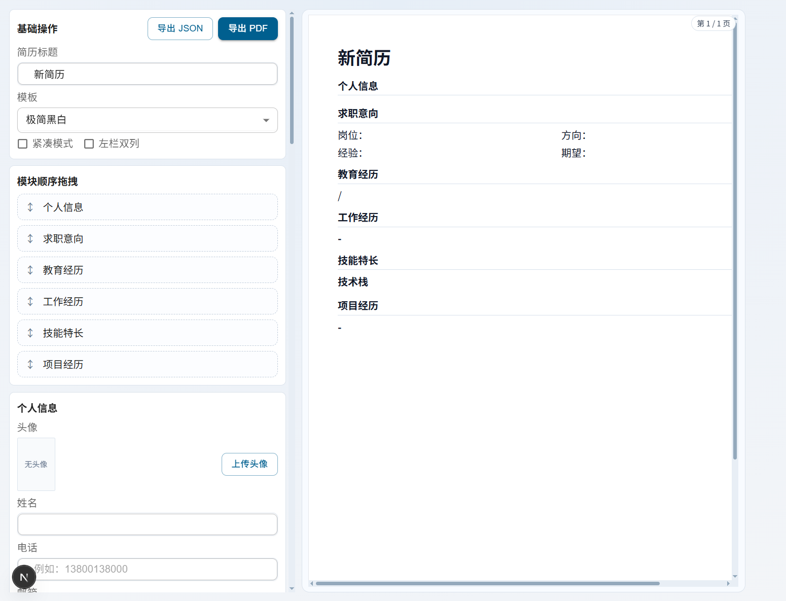
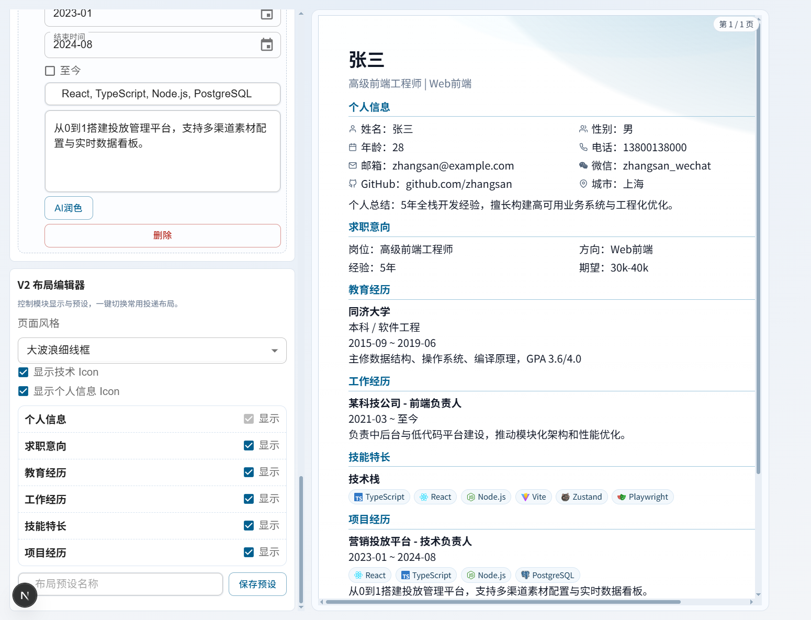

# IT Resume Builder

本项目是离线优先的 IT 简历生成器（React + TypeScript）。

## 预览

### 简历编辑界面

### 简历预览效果

## 功能
- 多份简历管理（IndexedDB）
- 5 套模板切换（极简/专业/双栏/深色高管/紧凑投递）
- 个人信息支持头像上传与预览
- 技术栈支持 Tag + 常见技术 Icon（如 Vue/React/TS）
- 模块与条目拖拽排序（dnd-kit）
- V2 布局编辑器（模块显隐、双栏区域拖拽与宽度、布局预设）
- 一键直接下载 PDF（本地 Playwright 服务生成）
- JSON 导入导出
- 本地 Ollama（OpenAI 兼容）项目经历润色

## UI 样式库
- 已对齐 `shadcn/ui` 官方 Vite 路径：`@tailwindcss/vite + Tailwind v4 + cva + Radix Slot`
- 组件库目录：`src/shared/ui`
- 工具函数：`src/lib/utils.ts`
- `@` 路径别名已启用（`@/* -> src/*`）

### 本地校准（建议）
在本地执行一次官方 CLI 校准：
1. `npx shadcn@latest init`
2. `npx shadcn@latest add button input textarea select label checkbox card`

## 运行
1. 安装 Node.js 18+
2. `npm install`
3. 启动前端：`npm run dev`
4. 启动 PDF 服务：`npm run pdf:server`

## Ollama 默认配置
- Base URL: `http://127.0.0.1:11434/v1`
- 接口: `/chat/completions`

## PDF 导出说明
- 导出按钮默认调用：`http://127.0.0.1:4177/export-pdf`
- 可通过环境变量 `NEXT_PUBLIC_PDF_SERVER_URL` 覆盖地址
- 若首次运行缺少浏览器，请执行：`npx playwright install chromium`
